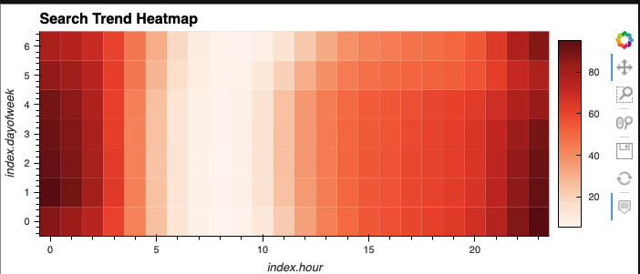
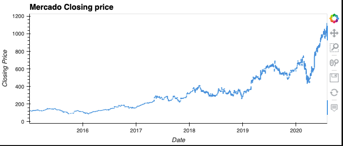
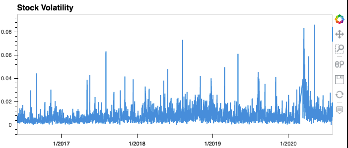

# Challenge11

## Mercado Libre
The goal of the assignemnt was to analyze the company's financial and user data to help fuel growth for the company.  By predicting site traffic in the future we can use our marketing dollars more wisley by spending more in higher traffic times.

## Examples

## Contributors
Matthew P Rudd - mprudd2@gmail.com

## License 
MIT